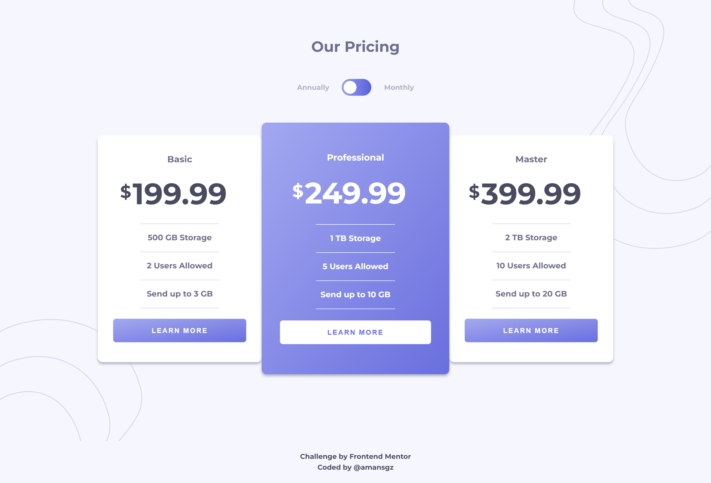

# 👩‍💻 Frontend Mentor - Pricing Component With Toggle

Frontend Mentor challenges help you improve your coding skills by building realistic projects. 
Join to [Frontend Mentor Discord community](https://discord.gg/UAfh3qzhYb)

This is a solution for [Pricing Component With Toggle](https://www.frontendmentor.io/challenges/pricing-component-with-toggle-8vPwRMIC) challenge.

## The challenge

Users should be able to:

- View the optimal layout for the site depending on their device's screen size
- See hover states for all interactive elements on the page

## Built with

- Semantic HTML5 markup
- CSS custom properties
- Flexbox
- Mobile-first workflow

## Live site solution

[Live site]() .

## Author

- Frontend Mentor - [@amansgz](https://www.frontendmentor.io/profile/amansgz)